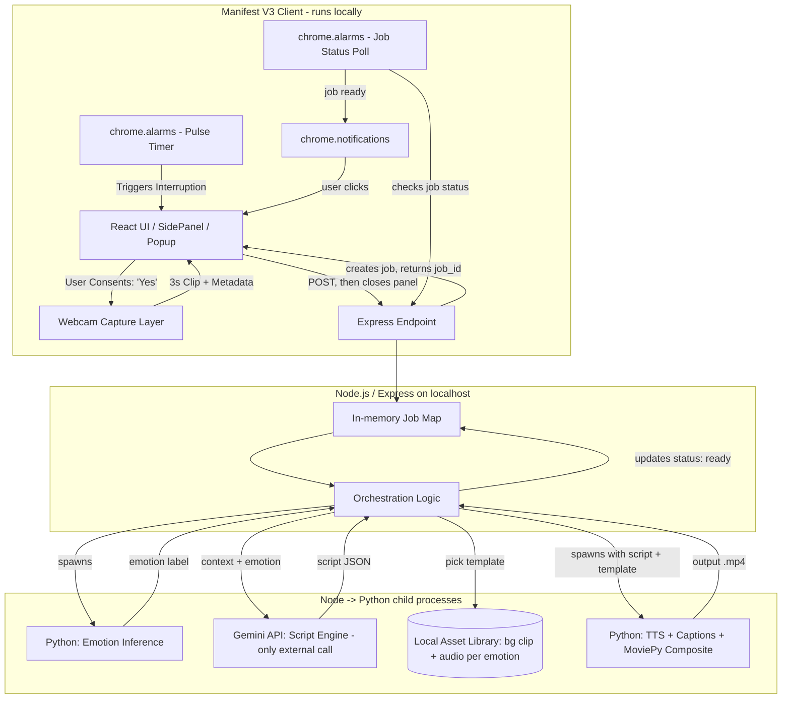

# MINDSTREAM — PROJECT OVERVIEW

_Local-first college project. This document is the single source of truth for any AI agent (or contributor) working in this repo — read this before touching code._

## 1. What This Is

MindStream is a browser extension that periodically checks in on a distracted/fatigued user, captures a brief webcam snapshot with explicit consent, infers their emotional state, and generates a short personalized 9:16 "focus reset" video reel using an LLM-written script + TTS + pre-built visual/audio templates. The reel is generated **asynchronously in the background** — the user is never made to sit and wait for it.

## 2. Core Problem Statement

Stress and loss of focus drive desktop users into unproductive doomscrolling loops, but current wellness tools rely on rigid restrictions or generic advice, failing to deliver the context-aware interventions needed to break these distraction cycles.

## 3. Project Scope: Local-First, College Project

This is **not** a hosted/cloud product. Everything runs on the developer's/user's own machine:

- The backend is a **local Node/Express server** (`localhost:<port>`), started manually (`node server.js` or similar) before the extension is used.
- The extension is **loaded unpacked** in the browser (Chrome, Manifest V3) pointed at that local server.
- No cloud queue, no hosted database, no multi-user concerns. Assume a single active user/session at a time — an in-process async queue (or even just an `async` function with a simple in-memory job map) is sufficient. Don't add infra (Redis, hosted job queues, etc.) that a college project doesn't need.
- External network calls are limited to the Gemini API (for script generation) — everything else (webcam, inference, rendering, storage) is local.
- The extension's `manifest.json` needs `host_permissions` covering the local server origin (e.g. `http://localhost:*/*`) since MV3 extensions must declare origins they fetch from.

## 4. The Interactive Check-In Flow

This is a sequence of distinct UI states, not one continuous screen — worth keeping the state machine explicit since several agents/contributors will be touching different parts of it.

1. **The Pulse Trigger:** After the user has been active in the browser for a threshold amount of time (tracked via `chrome.alarms`), the extension surfaces an **OS-level notification** (`chrome.notifications`) asking _"Want a quick snap check-in?"_ — not an in-panel prompt, since the side panel likely isn't open at this point.
2. **Consent & Skeleton State:** If the user clicks/accepts, the side panel opens and immediately shows a **skeleton loader** while the browser's native camera-permission dialog is pending. (That permission prompt is controlled by the browser, not the extension — the skeleton just covers the wait until the user responds to it.)
3. **The 3-Second Snap:** Once permission is granted, the panel shows a **live capture indicator** (the outgoing clip/preview) for ~3 seconds while `getUserMedia` records.
4. **Contextual Enrichment:** Alongside the clip, the extension packages local telemetry — active tab domain/category, time of day, session duration, idle time.
5. **Hand-off & Close:** The panel POSTs the payload, then shows an **in-panel countdown modal** — _"Your reel will be generated soon... 3, 2, 1"_ — then closes the side panel via `chrome.sidePanel.close({ tabId })` (Chrome 141+; see §8 for the version caveat and fallback).
6. **Background Processing:** The local server resolves the emotion, generates the script via Gemini, and composites the reel from a pre-built template (see §7). The user keeps working in the meantime.
7. **Mid-Process Errors:** If anything fails (no face detected, Gemini error, render failure), the extension surfaces an **OS-level notification** describing the issue, rather than leaving a stuck or broken panel.
8. **Ready Notification:** On success, another OS-level notification: _"Your snap is ready — wanna have a look?"_ Clicking it opens the side panel and plays the reel.

**Why this matters:** the intervention only works if it doesn't itself become a distraction. Nobody should be staring at a spinner — that's the opposite of the point.

### 4a. Pulse Timer State — Preventing Stacked/Duplicate Check-Ins

The Pulse Trigger (step 1) can't just be a dumb repeating alarm — without state, it will happily fire a _second_ check-in while the first reel is still rendering, or generate a brand-new reel because the user never clicked the "ready" notification for the last one. Since the backend only has one job slot at a time (§3), the extension has to guarantee only one check-in cycle is ever "active" (in flight or awaiting viewing) at once.

Track one small piece of state in `chrome.storage.local`, e.g.:

```json
{
  "cycle_status": "idle", // "idle" | "pending" | "ready" | "viewed" | "failed"
  "cycle_started_at": "2026-07-10T14:32:00Z"
}
```

On every `pulseTimer` tick, before doing anything else, check `cycle_status`:

- **`"pending"`** → a check-in is already being processed. Skip — don't show the "want a check-in?" prompt again. Just let the alarm re-fire later.
- **`"ready"`** (job finished but the user hasn't clicked the "wanna have a look?" notification yet) → don't start a _new_ capture cycle. Instead, re-fire the existing "your snap is ready" notification as a gentle reminder, and leave `cycle_status` as `"ready"`.
- **`"idle"` or `"viewed"`** → this is the only case where a new Pulse Trigger prompt should actually appear, and only if enough active time has accumulated since `cycle_started_at`.

State transitions:

- User accepts the check-in prompt (start of capture) → `cycle_status = "pending"`, `cycle_started_at = now`. This is what "resets the clock" — the threshold counts from the start of a cycle, not from install time or the last dismiss.
- Job completes → `cycle_status = "ready"` (or `"failed"`, which triggers the mid-process error notification and then resets straight to `"idle"` so the next pulse isn't permanently blocked by a dead job).
- User clicks the "ready" notification and views the reel → `cycle_status = "viewed"` → immediately reset to `"idle"` with `cycle_started_at = now`, since viewing the reel _is_ the break — the next threshold window should start counting from that moment, not stack on top of however long rendering took.
- User dismisses the initial "want a check-in?" prompt → no cycle starts, alarm just resets to check again after the threshold (as already noted in Phase 1).

This keeps the guarantee implicit in §3 ("single active session") actually true in practice, not just true of the backend's job map.

## 5. System Architecture



## 6. Technology Stack

- **Extension:** React, Vite, Tailwind CSS (v4), Chrome Manifest V3 APIs — `sidePanel` (requires Chrome 141+ for `close()` to self-close the panel after the countdown), `storage`, `alarms`, `notifications`.
- **Local Backend:** Node.js, Express.js, in-memory job tracking (a plain object/Map keyed by `job_id` is enough at this scale).
- **Emotion Detection:** Python CLI (DeepFace / OpenCV / MediaPipe) via `child_process`, run locally.
- **Script Generation:** Google Gemini API — the one component that calls out to the internet.
- **Media Rendering:** Python + `MoviePy`/`FFmpeg`, compositing generated TTS audio + captions onto a **pre-built local background asset** (not generating video from scratch per request).
- **Asset Library:** A local folder of background video loops, each **paired with matching ambient/background audio**, organized by emotion category (e.g. `frustrated`, `fatigued`, `distracted`, `anxious`, `neutral`). This is prebuilt once, checked into the repo (or documented as a setup step), and reused across generations.

## 7. Detailed Implementation Workflow

### Phase 1: Interactive Ingestion & Consent

- Service worker tracks intervals via `chrome.alarms`. On fire, messages the React side panel/popup to mount the prompt card.
- "No/Dismiss" → alarm resets. "Yes" → React calls `navigator.mediaDevices.getUserMedia`, records ~3s `.webm`, collects tab telemetry, POSTs to the local Express server, shows the "being put together" confirmation, then closes the panel.

### Extension → Local Backend Payload Contract

```json
{
  "session_id": "uuid-v4",
  "captured_at": "2026-07-10T14:32:00Z",
  "emotion": {
    "source": "client", // "client" if inferred in-browser, "server" if raw clip attached
    "label": "frustrated", // omit if source is "server"
    "confidence": 0.78
  },
  "context": {
    "active_tab_category": "entertainment",
    "active_tab_domain": "example.com",
    "time_of_day": "afternoon",
    "session_duration_minutes": 47,
    "idle_minutes_since_last_activity": 2
  }
}
```

If `emotion.source` is `"server"`, the request is `multipart/form-data` with the `.webm` clip attached instead of a `label`. The server responds immediately with `{ "job_id": "..." }` — it does not wait for processing to finish.

### Phase 2: Background Processing (Local)

1. **Emotion resolution:** use `emotion.label` if provided; otherwise spawn the Python inference script on the attached clip.
2. **Script generation:** send emotion + context to Gemini, request structured JSON (script lines, tone, category).
3. **Asset selection:** map emotion category → the matching background-clip + audio pair from the local asset library.
4. **Synthesis:** spawn the render worker — TTS + caption overlay composited onto the selected template — output a 9:16 `.mp4` to local storage.
5. **Cleanup:** delete the temporary webcam clip and any intermediate files as soon as they're no longer needed.
6. **Status update:** mark the job `ready` (or `failed`) in the job map, with the local file path/URL.

### Phase 3: Notify & Deliver

- The extension's service worker polls `GET /jobs/:job_id` on a `chrome.alarms` interval (a persistent open connection isn't reliable since MV3 service workers can be killed/suspended).
- On `ready`, fire `chrome.notifications.create(...)`: _"Your snap is ready — wanna have a look?"_
- On click, open the side panel and play the reel from the local server's static file route.
- On `failed`, fall back to a pre-rendered generic "reset" clip rather than notifying with nothing, or silently drop the cycle and let the next scheduled check-in try again — decide which behavior you want and note it here once chosen.

## 8. Open Questions / Decisions Still Needed

- ~~**Side panel auto-close feasibility.**~~ **Resolved:** `chrome.sidePanel.close({ tabId })` (and `{ windowId }`) exists as of **Chrome 141**, so the panel really can close itself right after the "3, 2, 1" countdown — no need to fall back to a minimal idle state on current Chrome. Two things worth pinning down for the demo:
  - Confirm the demo/grading machine's Chrome version is 141+ (`chrome://version`). If it's older, `close()` won't exist and the extension should catch that and fall back to collapsing the panel into a minimal idle state instead of erroring.
  - `chrome.sidePanel.onClosed` (Chrome 142+) can confirm the panel actually closed, if you want a signal to, say, stop the polling alarm early — optional, not required for the core flow.
- **Failure UX:** on a failed job, does the user get a fallback generic clip, a "something went wrong, try again" notification, or nothing (silent skip)? Pick one and update this doc.
- **Client-side vs. server-side emotion inference:** still worth a quick spike — client-side (e.g. `face-api.js`/TF.js in-browser) avoids spawning a Python process per check-in and is faster, but adds a JS ML dependency to the extension. Since everything's local anyway, the privacy motivation is smaller than in a hosted deployment — this is now mostly a latency/complexity trade-off, not a privacy one.
- **Notification when panel isn't open at all vs. minimized:** confirm `chrome.notifications` behaves as expected across the target browser/OS combo you're demoing on.
- **Emotion vocabulary:** constrain to a small, high-confidence set (4–5 categories) matching the asset library categories, rather than fine-grained labels the model can't reliably distinguish.
- **Reset timing after an unviewed "ready" reel:** §4a resets the clock when the user _views_ the reel. But if the reminder notification (for a `"ready"` cycle) also goes unclicked indefinitely, there's no timeout — decide whether an unviewed reel should eventually auto-expire back to `"idle"` after some cap (e.g. a few hours), so the user isn't permanently stuck unable to get a new check-in just because they ignored one notification.

## 9. Strict Directives for AI Agents

1. **No continuous streaming.** No background canvas rendering loops or continuous camera streams. Camera activates only inside an active UI frame following an explicit click handler.
2. **State ephemerality.** All webcam snapshots are deleted from local disk immediately after use, in a cleanup path that runs even on error.
3. **Decoupled Python scripts.** `analyze_face.py` and `render_reel.py` stay independent, arguments-driven CLI scripts with clear non-zero exit codes and stderr messages on failure.
4. **Non-blocking by design.** The `/check-in` endpoint (or equivalent) must return a `job_id` immediately and never hold the HTTP connection open while inference/rendering run.
5. **Local-only assumption.** Don't introduce cloud infrastructure (hosted queues, cloud storage, multi-tenant auth) — this is a single-user, single-machine college project. Keep dependencies installable via `npm install` / `pip install` with no external services beyond the Gemini API key.
6. **Fail toward a fallback, never toward a stuck or broken state.**

## 10. Near-Term Roadmap

1. ✅ Webcam capture + local download prototype (in progress).
2. Lock the payload contract (§7) so backend/Python work can start against a stable interface.
3. Build the tab-context + telemetry collector (active tab classification, idle time, session duration) — pure extension-side, no backend dependency.
4. Stand up the minimal local Express server: `/check-in` (accepts payload, returns `job_id` immediately) and `/jobs/:job_id` (returns status). Stub the processing with a fixed delay + canned response so the extension's full async/notification flow can be built and tested before real inference/rendering exist.
5. Build the `chrome.alarms`-based polling + `chrome.notifications` flow against the stub endpoint.
6. Assemble the local asset library (background clip + audio pairs per emotion category).
7. Wire in real emotion inference and rendering (Python side).
8. Decide on client-side vs. server-side inference (§8) once the above is working end-to-end.
